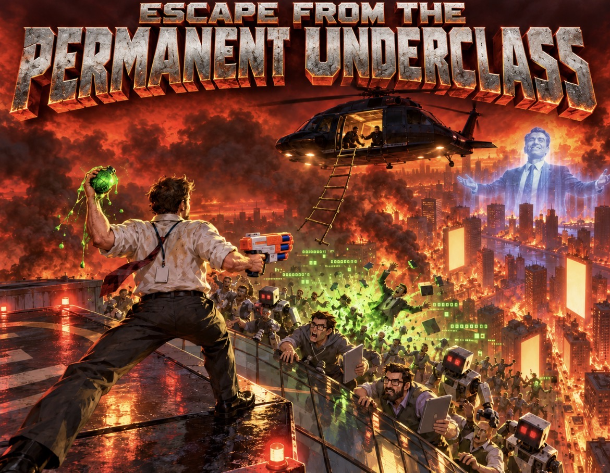

# Escape from the Permanent Underclass

[](https://github.com/MBemera/YNGM/actions/workflows/tests.yml)



A satirical first-person shooter with no gore, about escaping a San Francisco that an AI company has quietly bought. It
has eleven voiced levels, four difficulty settings and seven foam-and-hype weapons, plus a rope ladder that will not
wait for you. Codename **YNGM**.

**[Download the latest release](https://github.com/MBemera/YNGM/releases/latest)** for Windows 10/11, Linux x86_64 or
macOS 11+. Free, offline, no account.

## The story

Preston Exitwell, founder and CEO of Overclass, has announced "the transition". His flagship model, OMEGA, now does
everyone's job, and the city has split into two groups: people with a seat on the helicopter, and the permanent
underclass.

You fight your way up a Hypersynergy Labs tower and grab the ladder off the roof, expecting a rescue. Instead you wake
up in the Overclass Opportunity Center, labelling OMEGA's training data eighteen hours a day, paid in exposure. Then
Dana Kestrel, Overclass's fired head of alignment, gets in your ear and gets you out.

From there you run the frozen 101 and raid Down Round Capital on Sand Hill Road for Lance Upround's campus keys. You
survive a hackathon that wants you caught, wreck the Overclass campus and the GPU cold aisles where OMEGA trains, and
push through a container yard at Pier 70. The last stop is the Ark: Exitwell's offshore launch platform, where the
board is about to leave for orbit with OMEGA's weights. Beat the board, then beat Exitwell's exosuit, and you get to
write OMEGA's new objective.

Nobody dies. The enemies are VCs throwing term sheets, AI founders pitching at you, security bots, shift managers and
thought leaders. Beat them and they leave.

| # | Level | What you do |
|---|---|---|
| 1 | South of Market | Fight up the tower and reach the roof ladder before the helicopter leaves |
| 2 | The Opportunity Center | Smash three shift-quota terminals and break out through the loading dock |
| 3 | The 101 | Cross the gridlock and catch the last train south |
| 4 | Sand Hill Road | Take the campus keys from Lance Upround |
| 5 | Disrupt-a-thon | Survive the hackathon while Dana cracks the doors |
| 6 | Overclass Campus | Knock out OMEGA's four power relays |
| 7 | Cold Aisle | Destroy three cooling cores and take the freight lift |
| 8 | Pier 70 | Make the boat before it leaves |
| 9 | The Ark | Hold launch control, then reach the tower elevator |
| 10 | The Boardroom | Beat three board directors and their security |
| 11 | OMEGA | Bring down Exitwell's exosuit and rewrite OMEGA |

## Features

- Seven weapons, unlocked through the story: the Foam Dart Blaster, Confetti Cannon, Slop Grenade, NDA Stapler
  (stuns), Hype Railgun (goes through a whole line), Valuation Bubble (area pop) and Disruptor (chains between
  targets).
- Four difficulties: Easy - Trust Fund, Normal - Series A, Hard - Bootstrapped, Nightmare - Permanent Underclass.
- Objectives: timed escapes, destructible targets, survival waves and boss fights.
- Graphics presets (Auto, Low, Medium, High) and a frame counter. It runs on Intel UHD-class laptops, and frame rate
  is not capped beyond vsync on faster PCs.
- Cover-art loading screen with a progress bar and scrolling tips. Progress, difficulty and settings save
  automatically, and Level Select replays any level you have reached.

## Install

Each download is self-contained: no Godot, Python, account or internet connection needed. You need a keyboard,
a mouse and OpenGL 3.3-class graphics.

### Windows 10/11 (64-bit)

1. Download `YNGM-1.0.0-Windows-x64-Setup.exe` from [Releases](https://github.com/MBemera/YNGM/releases/latest).
2. Run it. The installer is not code-signed, so SmartScreen may warn you: choose **More info > Run anyway**.
3. It installs for your user only (no admin prompt) to `%LOCALAPPDATA%\Programs\YNGM` and adds a Start-menu
   shortcut, plus a desktop shortcut if you tick it.

To uninstall, use Windows **Installed apps** or `Uninstall.exe` in the game folder. Silent install: `YNGM-1.0.0-Windows-x64-Setup.exe /S`.

### Linux (x86_64)

```sh
tar -xzf YNGM-1.0.0-Linux-x86_64.tar.gz
cd YNGM
./install.sh            # copies to ~/.local/share/yngm and adds a menu entry
```

To run without installing, use `./YNGM.x86_64`. To uninstall, run `~/.local/share/yngm/install.sh --uninstall`.

### macOS (Apple Silicon on 13+, Intel on 11+)

1. Unzip `YNGM-1.0.0-macOS-universal.zip` and drag the app into Applications.
2. The app is ad-hoc signed but not notarised, so the first time you open it, right-click it and choose **Open**, then
   **Open** again.

### Let an AI assistant install it

Each package README ends with a request you can paste into Claude Code or Codex, opened in your download folder:

> Install "Escape from the Permanent Underclass" from the download in this folder. Read the README in the download
> and follow its steps exactly. Do not change anything else on my computer, and tell me what you did.

The Linux and macOS builds were exported and checked on Windows (binary format, permissions, signing, package
contents, and the game pack passing the test suite). They have not yet been run on real Linux or Mac hardware.

## Controls

| Action | Key |
|---|---|
| Move / look | WASD / mouse |
| Sprint / jump | Shift / Space |
| Fire | Left mouse button |
| Switch weapon | 1-7 or mouse wheel |
| Restart level | R |
| Release the mouse | Esc |
| Skip story scenes | Enter |

Green **BRIDGE ROUND** crates restore your runway (health).

## Build from source

The game is a [Godot 4.7.2](https://godotengine.org/download/archive/4.7.2-stable/) project (the standard build,
not .NET) in `game/`. To play from source, open `game/project.godot` in the editor, or run `godot --path game`.

To build all three packages on Windows:

1. Put the Godot 4.7.2 Windows console editor and its export templates in `tools/godot/`, and NSIS 3.13 in
   `tools/nsis/nsis-3.13/`. Both folders are git-ignored; see the [packaging guide](installer/README.md).
2. `python -m pip install -r tools/packaging/requirements.txt`
3. `python tools/packaging/build-yngm.py`

The packages land in `dist/`, with sizes and SHA-256 hashes in [dist/build-result.json](dist/build-result.json).
Voice clips are pre-generated and committed. `tools/generate_voice.py` regenerates missing ones with Piper
(pinned in `tools/tts/requirements.lock.txt`).

## Tests

```sh
godot --headless --path game --script res://tests/test_level.gd                    # gameplay, menus, weapons, loading screen
godot --headless --path game --script res://tests/test_levels.gd -- --levels=1,2,3,4,5,6,7,8,9,10,11   # every level has floors, navigation and a walkable route to each objective
python -m pytest tools/packaging                                                    # installer artwork
```

[GitHub Actions](.github/workflows/tests.yml) runs all three on every push and pull request, using the official
Godot 4.7.2 Linux build with its checksum verified. `game/tests/autoplay/` also contains a frame-rate benchmark and
a bot that plays the whole campaign.

## Repository layout

| Path | Contents |
|---|---|
| `game/` | Godot project: scripts, levels, story (`data/story/`), assets, tests, licence texts |
| `installer/` | NSIS installer script and packaging notes |
| `tools/packaging/` | Build script for the Windows installer and the Linux and macOS packages |
| `tools/` | Voice, sound-effect, texture and recording helpers |
| `recordings/` | Benchmark and playthrough results |

## Legal

Everything here is fictional satire: no real company, product or person is depicted, and none is affiliated with
the game. The original code and content are [MIT licensed](LICENSE). Third-party assets (Godot, Kenney, Quaternius,
Poly Haven, Poly Pizza, NSIS) keep their own licences, nearly all CC0 or MIT. The `joe_*.wav` voice clips are
excluded from MIT because of their training-data licence.

[LEGAL.md](LEGAL.md) has the full list of tools and assets, licences, voice provenance, AI-assistance disclosure,
trademark notes and privacy statement.
